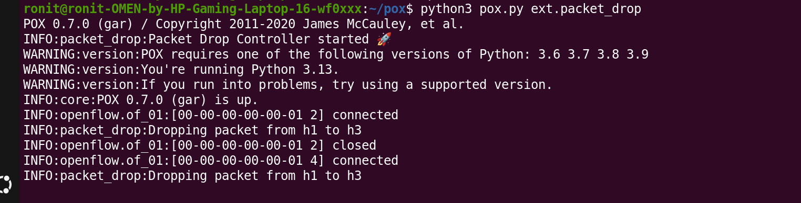
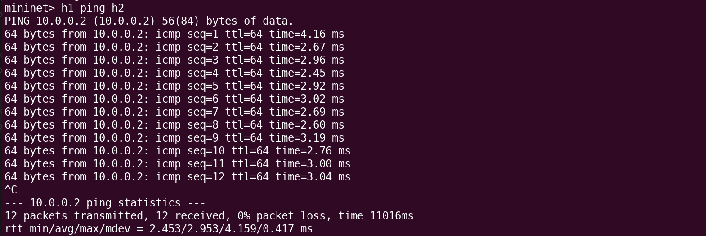
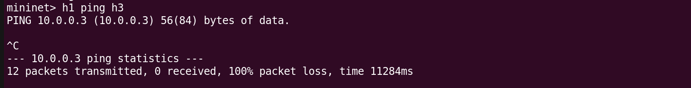
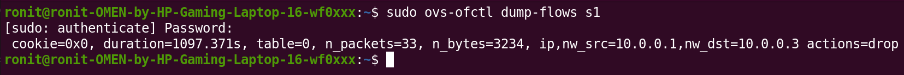

# 🚀 Packet Drop Simulator using SDN (POX + Mininet)

## 📌 Overview

This project demonstrates how **Software Defined Networking (SDN)** can be used to control network behavior by dynamically installing flow rules. Using the POX controller and Mininet, we simulate **packet loss** by selectively dropping traffic between specific hosts.

---

## 🎯 Objective

* Implement SDN controller logic using POX
* Design match–action flow rules
* Simulate packet drop behavior
* Analyze network performance using ping

---

## 🏗️ Network Topology

* 1 Switch (s1)
* 3 Hosts (h1, h2, h3)

```
h1 ----\
        s1 ---- h3
h2 ----/
```

---

## ⚙️ Technologies Used

* **Mininet** – Network emulation
* **POX Controller** – SDN control logic
* **OpenFlow** – Communication protocol

---

## 🧠 Working Principle

* The controller listens for `PacketIn` events
* It inspects incoming packets
* If traffic is from **h1 → h3**, it installs a **DROP flow rule**
* DROP rule = flow rule with **no actions**
* Switch drops matching packets → simulating packet loss

---

## 🚀 Execution Steps

### 1️⃣ Start Controller

```bash
cd ~/pox
python3 pox.py ext.packet_drop
```

---

### 2️⃣ Start Mininet

```bash
sudo mn -c
sudo mn --topo single,3 --controller remote
```

---

### 3️⃣ Test Scenarios

#### ✅ Allowed Traffic

```bash
h1 ping h2
```

✔ Result: 0% packet loss

---

#### ❌ Blocked Traffic (Packet Drop)

```bash
h1 ping h3
```

❌ Result: 100% packet loss

---

## 📸 Proof of Execution

### 🟢 Controller Running



---

### 🟢 Allowed Traffic (h1 → h2)



---

### 🔴 Blocked Traffic (h1 → h3)



---

### 📊 Flow Table (Switch Rules)

```bash
sudo ovs-ofctl dump-flows s1
```



---

## 📊 Observations

* Normal communication between h1 and h2 works correctly
* Traffic from h1 to h3 is completely blocked
* Demonstrates dynamic traffic control using SDN

---

## 🧩 Key Concept

> Installing a flow rule with no actions causes the switch to drop packets, enabling controlled packet loss simulation.

---

## 📚 References

* POX Controller Documentation
* Mininet Documentation

---

## 👨‍💻 Author

Ronit

---
